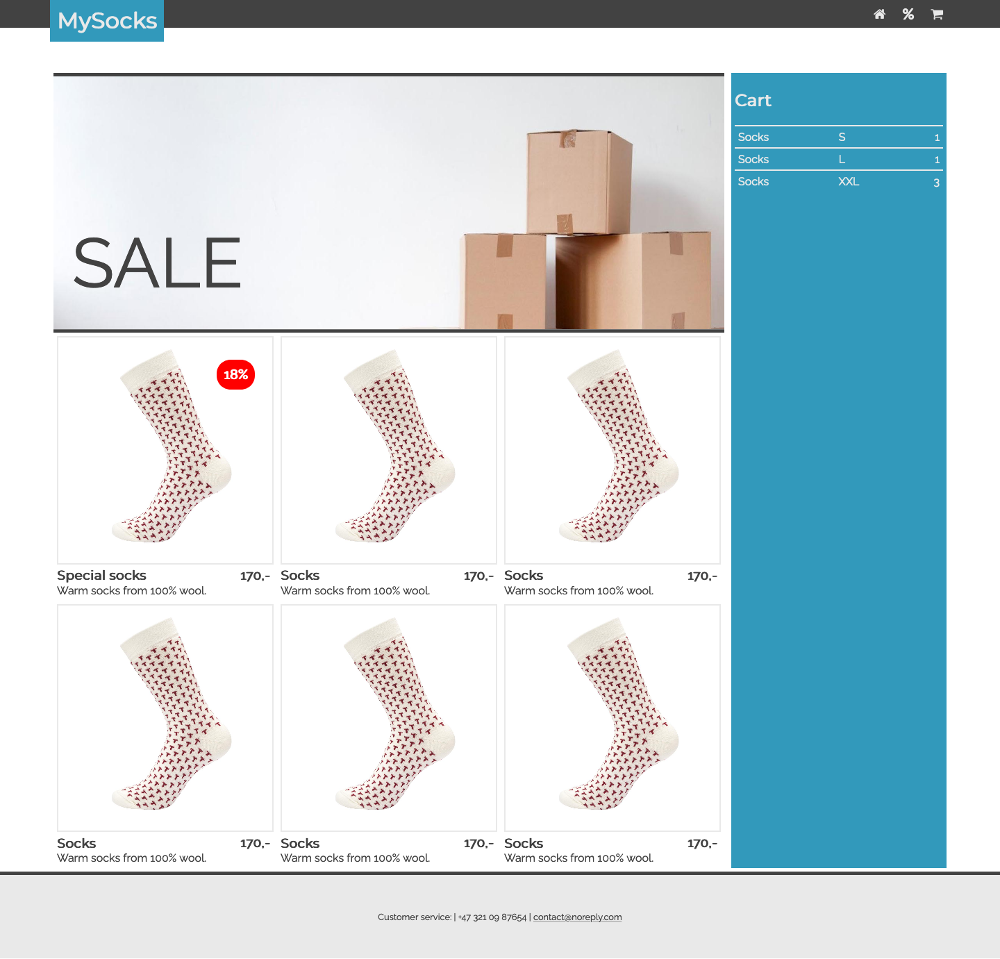
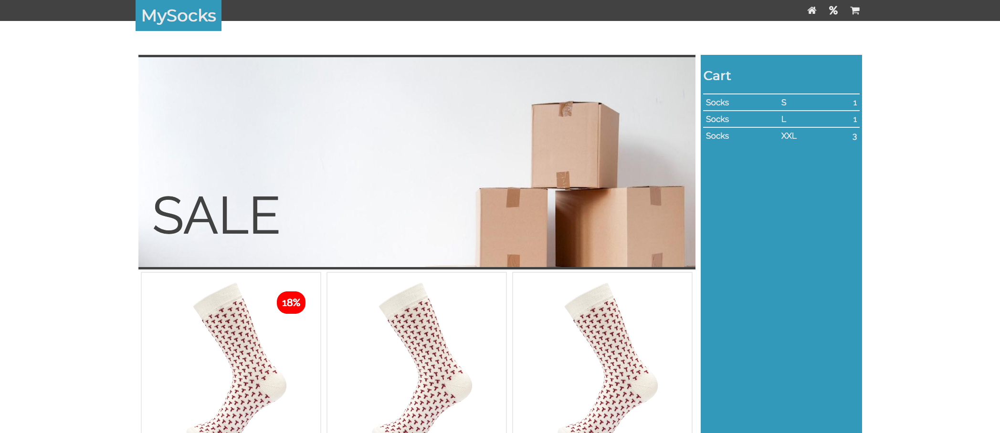
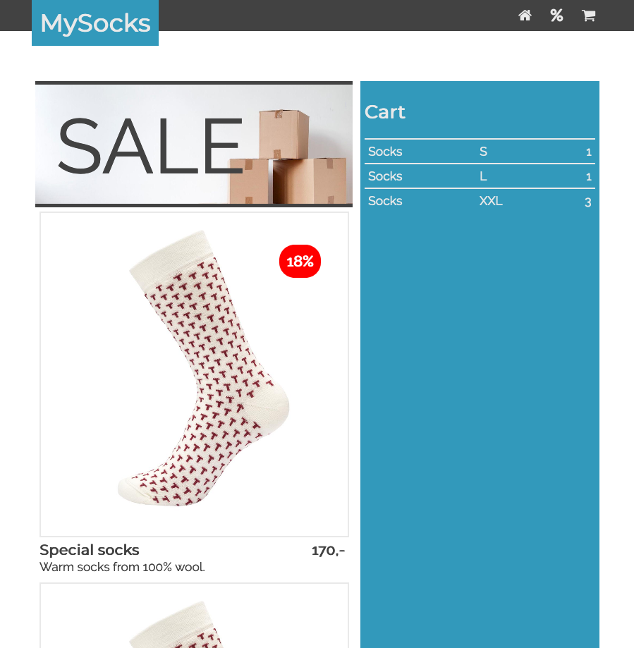
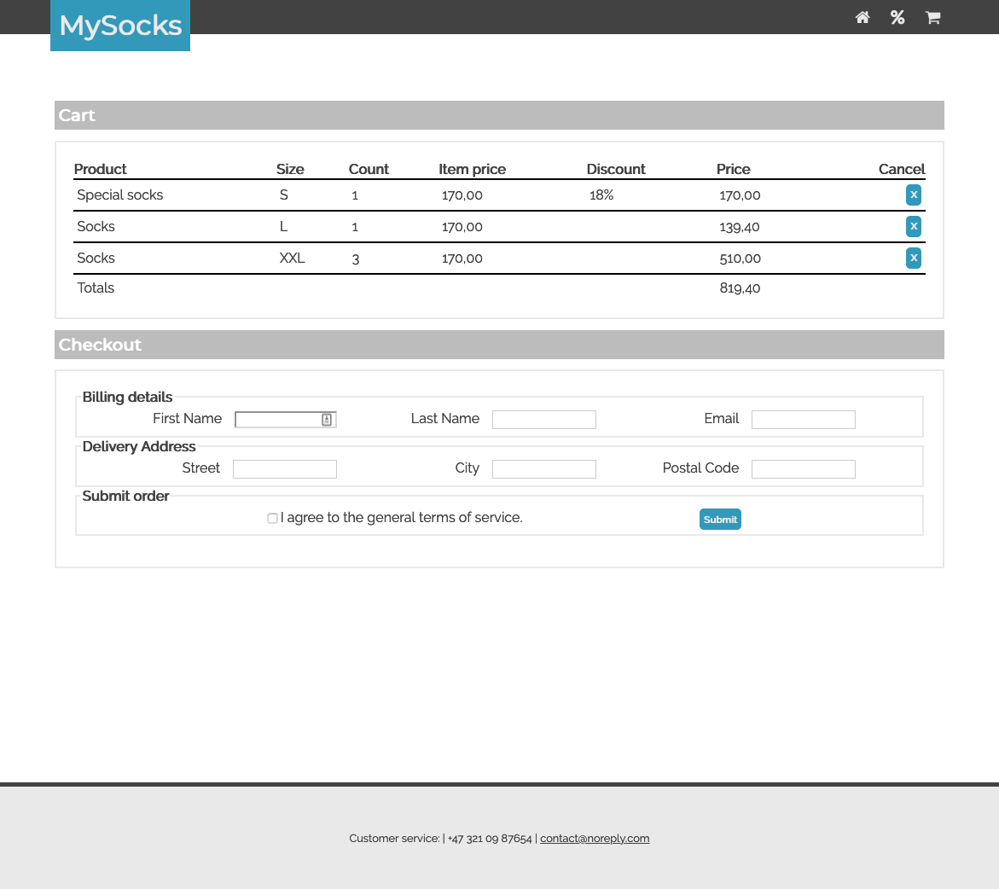
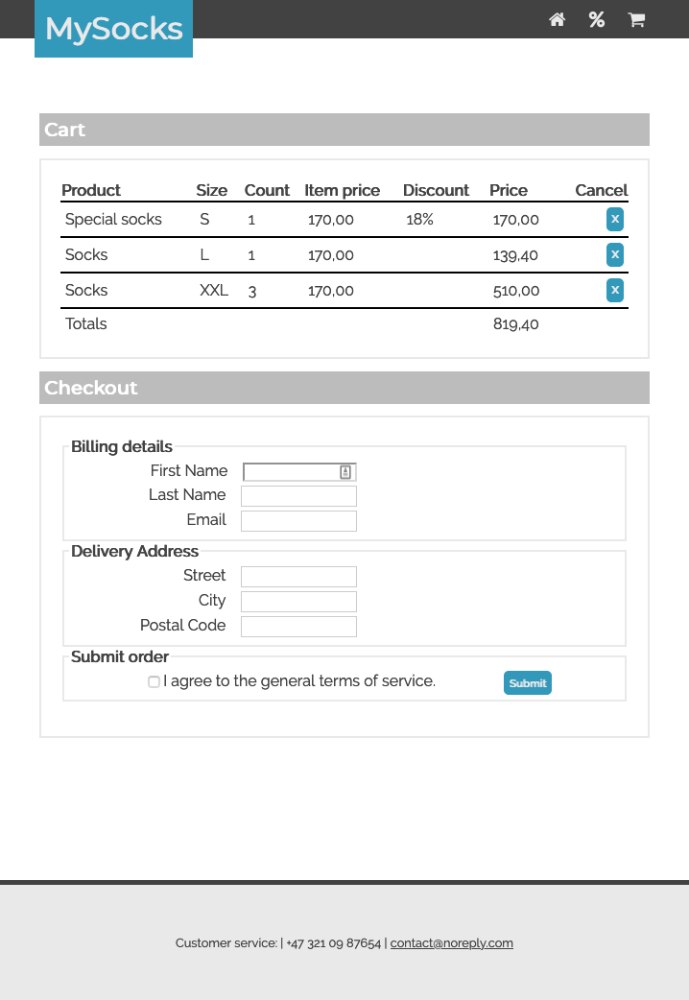

# Assignment 3 - Shopping prototype

In this assignment you need to create a prototype for a (online shopping) site using HTML and CSS. The prototype consists of two HTML pages (front page `index.html`, and shopping cart/checkout `cart.html`) and a single stylesheet file (`style.css`).

Under the `samples/` folder you will find screenshots that serve as examples of what you need to create. You don't have to produce the exact same output that is shown on the samples, you can deviate from it in any way you want (especially in the content) as long as you follow the instructions given below.

Note that you *only create a mockup*. The content does not have to be dynamic. We will do that in a later lab.

Media and images which you use should be creative commons licensed. If you need to attribute the author put a comment in the html/css.
[Openverse](https://wordpress.org/openverse/) is a good resource.

[Images](#images)

### Fonts and colors

  * Use	sans-serif font family.
  *	You should select a color palette with maximum five colors, and use only those colors (plus white for page background), e.g. (Paletton)[https://paletton.com/]
    

### Layout

  *	Use the `<header>`,` <main>`, and `<footer>` HTML5 tags for structuring the page.
  *	The elements below are the same on all pages.
  *	**Header**
    -	Height is 40px. The header is always visible, even when the page is scrolled down.
	-   It has a background color from the palette
    -	The logo area has a height of 60px. It is positioned 5% from the left of the containing element
        -	You can write the name of your site here and/or create a logo. [Openverse](https://wordpress.org/openverse/)
        -	The logo needs to overlay any content (i.e., needs to have the highest z-index).
    -	The main menu is part of the header and is horizontally aligned.
        -	It must be inside a `<nav>` element.
        -	It is right aligned and 5% from the right side of the page.
        -	It contains 2, pointing to index.html and cart.html (Obs image has 3 links).
        - Every link is represented by an icon.
  *	**Main**
    -	There has to be 100px vertical space (margin or padding) on top of the main area.
    -	The main area is 90% of the width of the page and is center-aligned. That means it resizes automatically when the window is resized, but has a maximum width of 1400px (see the screenshots under `samples/`).
    -	Main headers (h1) inside `<main>` have a background color, 1.2em font size, and 5px padding around (see Product Page).
    -	Framed boxes (class `.framed`) have a solid 1px border and 5px padding. The font-size is 0.8em.
  *	**Footer**
    -	The footer always stays at the bottom of the page. For an extra challenge, the footer can be "sticky": See Optional 2.
    -	The height of the footer is 120px. It has a 5px wide top border.
    -	The footer contains contact information (tel, email). These are center-aligned both vertically and horizontally.

### Front page (`index.html`)

  * The front page contains a summary of the shopping cart in an `<aside>` element and the shop content.
  * The shopping cart summary:
    - Has a width of 300px.
    - Is placed to the right, inside the `<main>` element.
    - Contains a clickable `<h2>` heading that links to `cart.html`.
    - Contains a table with contents of the shopping cart (at least 3 rows).
    - Is highlighted with a different background color.
  * The shop content:
    - Contains an (background) image banner that spans the width (i.e. 100%) of the shop content and resizes with the page. It has 5px wide solid top and bottom borders. 
    - Contains (at least) 3 products.
      - Put each product inside an `<article>` element.
      - The products have a target width of 280px, but may grow or shrink to fit on a line.
      - Depending on screen size, 1 or more products are shown per line.
      - Products contain an image, product name and a short summary.
      - Image is inside a framed box and resizes with the `<article>`.
      - Product name is an `<h3>`, with no margins.
      - Price is displayed together with the product name, but is right aligned.
    - Change the appearance of the product on mouseover, e.g. change background or borders)
    - Some of the products should contain a discount batch that is displayed on top of the image.
    - Discount batch should be located 30px from the top and right side of the frame around the image.
  *Hint: Images with the same dimension will make the design easier.*

### Shopping cart page (`cart.html`)

  *	Display a "Cart" header (h1).
  * Display the cart as a table in a framed box `.framed`.
  * The table contains the product name, size, count, price, discount, calculated price, and for every row a cancel button.
  *	Display a "Checkout header" header (h1).
  * Display the checkout form in a framed box.
  * Checkout form contains the fields with appropriate input types
    - First name
    - Last name
    - Email
    - Street
    - City
    - Postal code
  * Form also contains a checkbox for agreeing to terms of service and a submit button.
  * Form elements are structured into Billing details, Delivery address and Submit order, as shown in images.
  * Form elements are horizontally and vertically aligned.
  * Form fields have the same size and labels are right aligned. 

Commit and push the files you created (`index.html`, `cart.html`, `style.css`, plus optional images) to GitHub.

**Optional1** Use a media query to display the `<aside>` element on top rather then next to the main content on small screens, as shown in [here](samples/optional_index_small.png). Hint: use a media query to change the flex-direction as in [this example](https://www.w3schools.com/csS/tryit.asp?filename=trycss3_flexbox_website2).

**Optional2** The footer is "sticky" (i.e., when the page is long, you need to scroll down to see the footer)
  - Main idea is to set `height: 100%` on the `<html>` and `min-height: 100%` on the `<body>` element.
  - Then position the footer absolute, or use a flexbox.
  -	See, e.g.,: https://css-tricks.com/couple-takes-sticky-footer/

# Oppgave 3 - Webshop-prototype

I denne innleveringen skal du lage en prototype for en (online shopping) nettside ved bruk av HTML og CSS. Prototypen skal bestå av tre HTML sider (hovedsiden `index.html` og handlekurv/utskjekk-siden `cart.html`) og en enkel css-fil (`style.css`).

Under `samples/` mappen finner du skjermbilder som skal fungere som eksempel av hva du skal lage. Du trenge ikke å lage en eksakt kopi av bildene, og så lenge du følger instruksjonene under kan du forandre på dem som du ønsker (spesielt i innhold).

Merk at i du *bare lager en "mockup"*. Innholdet trenger ikke å være dynamisk. Vil vil gjøre de i en senere lab.

### Skrift og farge

  *	Sans-serif font familie.
  *	Du må velge en color palette med max fem farger, og bruk kun disse fargene (pluss whit for sidebakgrunn), e.g. (Paletton)[https://paletton.com/]

### Layout
  
  *	Bruk `<header>`, `<main>`, og `<footer>` HTML5 taggene for å strukturere siden.
  *	Elementene under er like på alle sider.
  *	**Header**
    -	Høyden er 40px. Headeren er alltid tilgjengelig, selv om vi blar nedover siden.
    -	Logoen skal ha en høyde på 60px. Den er posisjonert 5% fra venstre kant av overordnete element. 
        -	Du kan skrive navnet på siden din her og/eller lage en logo [Openverse](https://wordpress.org/openverse/)
        -	Logoen må ligge over alle andre typer innhold (ergo den trenger å ha den høyeste z-indexen).
    -	Hovedmenyen er en del av headeren og ligger på rekke horisontalt.
        -	Det skal være en uordnet liste inni et `<nav>` element.
        -	Den er justert mot høyre og ligger 5% fra høyre side av dokumentet.
        - Den inneholder 2 lenker, som peker til index.html og cart.html (obs bildet har 3 lenker).
        - Hver lenke er representert med et ikon.
    
  *	**Main**
    -	Det skal være 100px vertikalt rom (margin eller padding) på toppen av mainområdet.
    -	Skal være 90% i bredden og være sentrert. Det betyr at den skal automatisk tilpasse seg når sidestørrelsen forandres, men den skal ha en maximum bredde på 1400px (se bildene under `samples/`).
    -	Hovedoverskrifter (h1) i `<main>` skal ha en bakgrunnsfarge, 1.2em font størrelse og 5px padding rundt (e.g. på produktsiden)
    -	Innrammede bokser (class `framed`) har en solid 1px border og 5px padding. Font størrelse 0.8em.

  *	**Footer**
    -	Footeren skal alltid være på bunnen av siden. Optional kan den være sticky (se optional 2).
    -	Høyden skal være på 120px. Den skal ha en 5px bred topp border.
    -	Footeren skal inneholde kontaktinformasjon (telefon, e-post). Disse er sentrert både vertikalt og horisontalt.

### Hovedsiden (`index.html`)
  
  * Hovedsiden inneholder et sammendrag av handlekurven i et  `<aside>` element og butikk-innholdet.
  * Sammendrag av handlekurven:
    - Har en bredde på 300px.
    - Plasseres til høyre, inne i `<main>` elementet.
    - Inneholder en klikkbar `<h2>` overskrift som lenker til `cart.html`.
    - Inneholder en tabell med innholdet i handlekurven (minst 3 rader).
    - Blir fremhevet gjennom en annen bakgrunnsfarge.
  * Butikk-innholdet:
    - Inneholder et bildebanner som spenner over bredden (dvs. 100%) av butikk-innholdet og som tilpasses sidestørrelsen automatisk. Den har 5px bred solid topp og bunn border.
    - Det skal listes (minst) 3 produkter.
      - Plasser hvert produkt i et eget `<article>` element.
      - Produktene har en målbredde på 280px, men kan vokse eller krympe for å passe på en linje.
      - Avhengig av skjermstørrelse vises 1 eller flere produkter per linje.
      - Produktene inneholder et bilde, produktnavn, pris, og en kort oppsummering.
      - Bildet vises i en box med ramme (`.framed`) og forandrer størrelse sammen med `<article>`.
      - Produktnavnet er en `<h3>` uten marginer.
      - Pris vises sammen med produktnavnet, men justert til høyre.
    - Endre utseendet til `<article>` elemented ved "mouseover", f.eks. endre bakgrunn eller border).
    - Noen av produktene skal inneholde en rabattmarker som vises opp på bildet.
    - Rabattmarkeren skal være plassert 30px fra oversiden og høyre siden rammen rundt bildet.

### Handlekurv side (`cart.html`)

  * Vis en "Cart" overskrift (h1).
  * Vis handlekurven som en tabell i en innrammet boks `.framed`.
  * Tabellen inneholder product name, size, count, item price, discount, calculated price, og for hver rad en cancel-knapp.
  * Vis en "Checkout" overskrift (h1).
  * Vis utsjekkingsskjema i en innrammet rute.
  * Skjemaet inneholder feltene med passende inndatatyper
    - Fornavn
    - Etternavn
    - E-post
    - Gate
    - By
    - Postnummer
  * Skjemaet inneholder også en avkrysningsrute (checkbox) for å godta tjenestevilkår og en sende-knapp.
  * Skjemaelementer er strukturert i Billing details, Delivery address, og Submit order, som vist på bilder.
  * Formelementer er horisontalt og vertikalt på linje.
  * Formfelt har samme størrelse og etikettene er riktig justert.

**Optional1** Bruk en media query for å vise `<aside>` elementet overfor, heller en ved siden av hoved innholdet på skjermer mindre enn 1200px, som vist [her](samples/optional_index_small.png). Tip bruk en media query for å bytte ut flex-direction som i [dette eksempel](https://www.w3schools.com/csS/tryit.asp?filename=trycss3_flexbox_website2).

**Optional2** Footeren skal kunne "blas vekk" (dersom siden er for lang må brukeren bla ned for å kunne se den).
  - Hovedideen er å sette `height:100%` på `<html>` og `min-height: 100%` på `<body>` elementet.
  - Deretter bruk absolutt posisjonering på footeren, eller bruk en flexbox.
  -	Eller se, for et eksempel: https://css-tricks.com/snippets/css/sticky-footer/

Commit og push filene du laget (`index.html`, `cart.html`, `style.css`, plus valgfrie bilder) til GitHub.

## Images

#### Full index page

#### index page on wide screen

#### index page on small screen

#### cart page on wide screen

#### cart page on small screen
